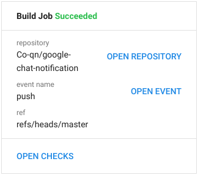
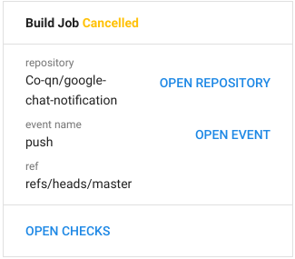
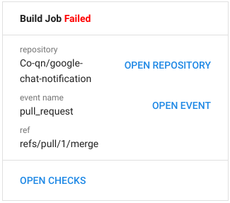

# Google Chat Notification for GitHub Actions


Sends a Google Chat notification.

This repository is generated by [typescript-action](https://github.com/actions/typescript-action).





## Usage
### Parameters
|Name|Required|Description|
|:---:|:---:|:---|
|name|true|Job name. Used for notification titles.|
|url|true|Google Chat Webhook URL.|
|status|true|Job status. Available values are `success`, `failure`, `cancelled`. We recommend using `${{ job.status }}`|

### Examples
```yaml
- name: Google Chat Notification
  uses: Co-qn/google-chat-notification@releases/v1
  with:
    name: Build
    url: ${{ secrets.GOOGLE_CHAT_WEBHOOK }}
    status: ${{ job.status }}
  if: always()
```
